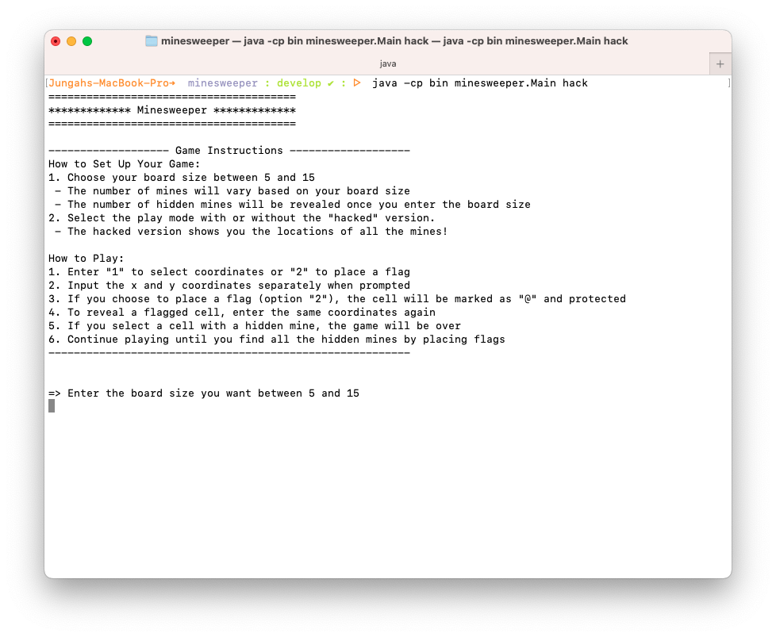
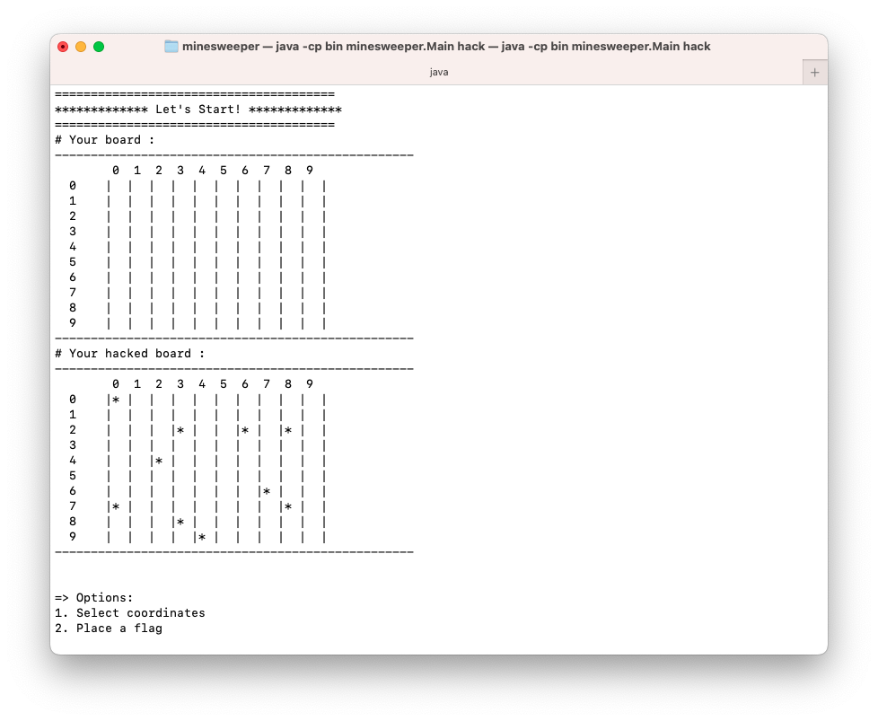
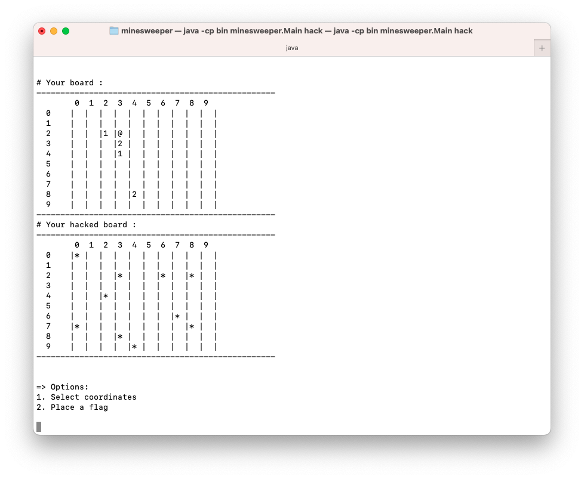

# Java CLI Game - Minesweeper

This is a Minesweeper command-line interface (CLI) game written in Java.

## Screenshots

Run the game in hack mode:

## Requirements

- Recreate a simplified version of Minesweeper for the Java console.
- Randomly generate 10 mines in a 10x10 grid.
- Allow users to input coordinates to check a location for a mine.
- Display a number from 0-8 indicating the number of surrounding mines for each location.
- If the user selects a mine, respond with "boom!" and the game is lost.
- If all non-mine squares are revealed, the game is won.
- Render the grid to the console after each user command.

## Features

- **Choose board size**: Players can interactively select the board size, and the game will generate mines randomly based on the chosen size.
- **Place a flag**: Players can place flags on the board, up to the number of mines present. Flags can also be removed, and when a coordinate is revealed, it will show if it contains a mine or the number of nearby mines.
- **Hack Mode with Command Line Argument**: There is a hacked version available that reveals the location of mines, for those who want to play with some assistance.

  To enable the hack mode in Eclipse, follow these steps:

  1. Navigate to `Run As` -> `Run Configurations`.
  2. In the `Arguments` tab, add `hack`
  3. Click `Run` to execute the program in hack mode

  In Terminal, follow these steps:

  1. Move into the parent directory of `bin` and `src`
  2. Run the program with the hack command, just after the file name: `java -cp bin minesweeper.Main hack`

## Future Improvement

[v] Implement a command-line argument feature to upgrade the current hack version. 
[ ] Refactor the `Board` and `Run` classes by breaking down some of the implementation into separate classes.
[ ] Refactor the marks for flags, revealed cells, mines to improve the readability, currently they are represented as numbers (88, 99, 100) respectively.
